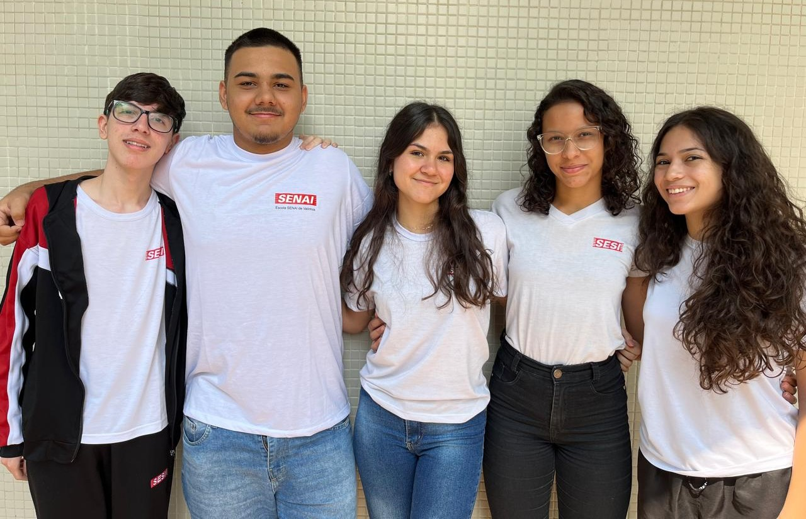
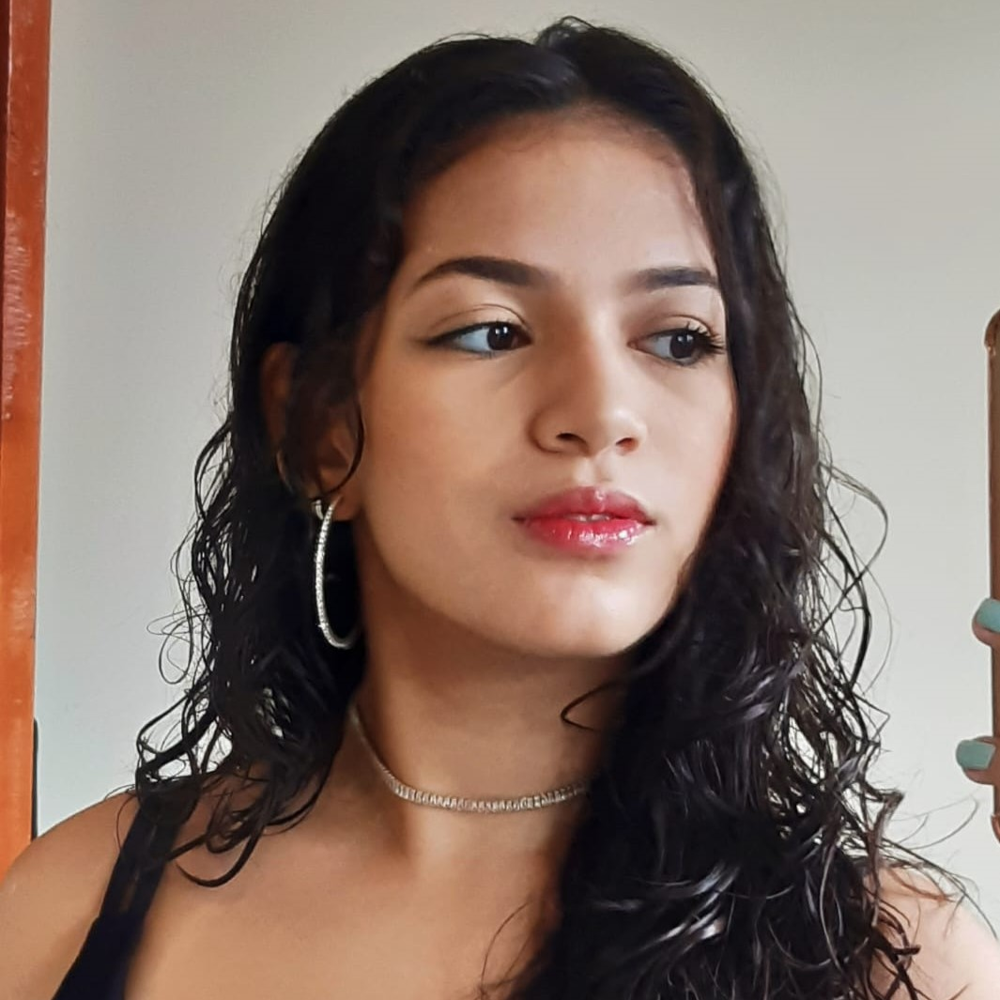
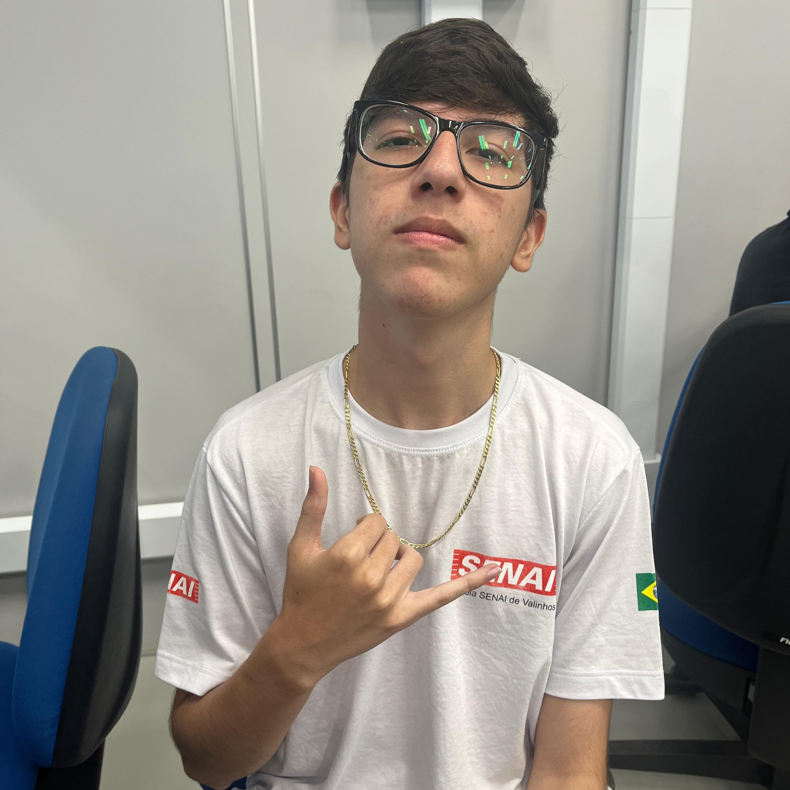
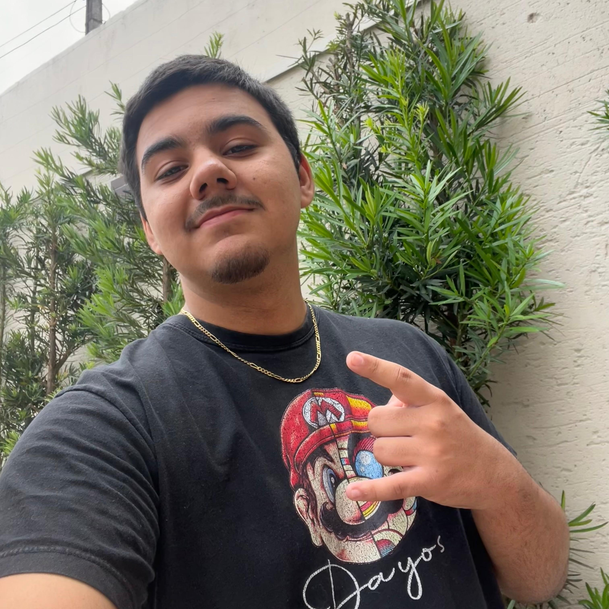

# ⭐ Bem-vindos ao repositório da equipe de Sociologia!

Este projeto tem como finalidade a criação de um Portal de Matérias voltado aos alunos das escolas SESI e SENAI. As turmas 2TDS1 e 2TDS2 foram organizadas em pequenas equipes, com cada uma responsável por uma matéria escolar específica, enquanto uma equipe ficou destinada ao desenvolvimento do Portal.

Neste repositório, encontra-se todo o trabalho realizado pela equipe de Sociologia. Este site inclui as seguintes seções: Home, Carreiras, Dicas, Simulados, Notícias, Video-Aulas e Sobre Nós. Toda a equipe se dedicou fielmente para entregar um site responsivo, visualmente atraente e dinâmico.

## 💻 Equipe de Sociologia

| 🌟 Laura Violla - Product Owner | ⭐ Evelyn Oliveira - Scrum Master | 👩‍💻 Bruna Savelli - Desenvolvedora  |
|--------------------------------|-------------------------------|-----------------|
|  |  |  |

| 👨‍💻 Lucas Zani - Desenvolvedor | 👨‍💻 Luiz Henrique - Desenvolvedor  |
|-----------------|-------------------|
|  |  |